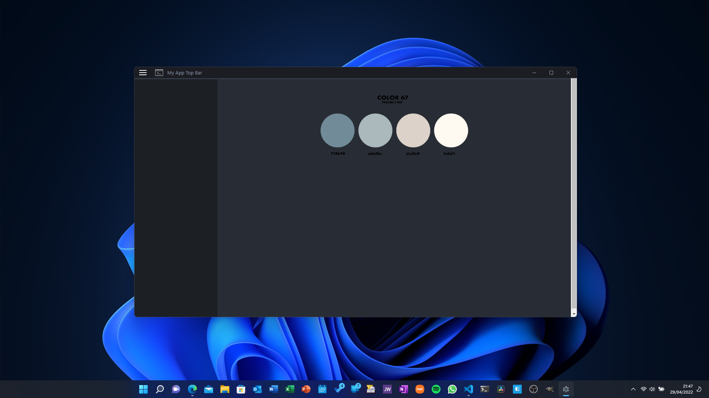
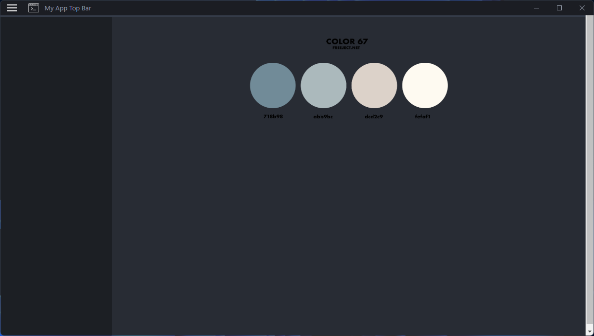
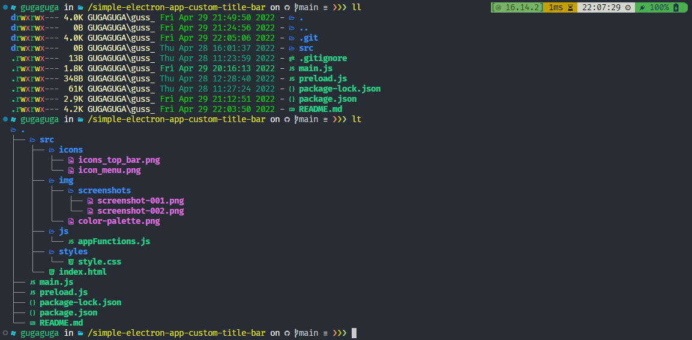

# Electron JS Simple Window with custom title bar and frameless window





<!-- TOC -->

- [Electron JS Simple Window with custom title bar and frameless window](#electron-js-simple-window-with-custom-title-bar-and-frameless-window)
    - [Stack](#stack)
    - [Get started](#get-started)
    - [Tutorial](#tutorial)
    - [Project Structure](#project-structure)
    - [About me](#about-me)

<!-- /TOC -->

## Stack

- [Electron](https://www.electronjs.org/) - A framework for building cross-platform desktop apps using HTML, JS, and CSS

## Get started

```sh
npm i
npm start
```

## Tutorial

This project is based on [Wanderson Youtube channel](https://www.youtube.com/channel/UCy1fv5dh3wQEem1nFAUBJzw).

You can watch this tutorial in the link below:

https://www.youtube.com/watch?v=6OcAoXr40oE&t=472s

## Project Structure



## About me

<!-- TOC ignore:true -->
### Olá! 👋

Me chamo Gustavo Siqueira, também conhecido como Guga. Estou aqui para compatilhar códigos com o mundo!

- 🌱 Atualmente estudo front-end 🌎 Web Development: HTML | CSS | JavaScript.
- 🦾 Atualmente estudo back-end: ☕ Java | 🐍 Python | 🟪 C#
- 🐞 Atualmente estudo QA: Testes automáticos com JUnit | Selenium | Cucumber | Appium
- 📫 Pode me contatar através do e-mail: guss.ns@gmail.com

<div align="center">
  <a href="https://github.com/siqueira-gustavo">
  
  
</div>
<div style="display: inline_block"><br>
  
  
  
  
  
  
  
  
  
  
  
  
</div>

<!-- TOC ignore:true -->
##

<div>
  <a href = "mailto:guss.ns@gmail.com"></a>
  <a href="https://www.linkedin.com/in/gustavo-siqueira-759465181/" target="_blank"></a>

  <!--  -->

</div>
